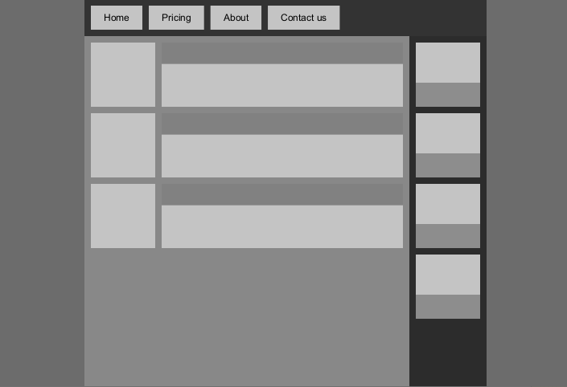

# About the project

Imperative UI library written in Kotlin. 

**This project is very early in development, not very usable at the moment. Does not implement any UI controls just yet.**

Features:

* Library for laying out elements. 
* Basic elements:
  * Rectangle - just something to place inside a layout;
  * Text line - simple text to place inside a layout.
* Basic layouts:
  * Box - place child elements on top of each other;
  * Row/Column - place child elements one after another;
  * Flex row/column  - place child elements one after another, wrap to the next column/row if they don't fit.
* Compose inspired builder for creating the UI, without actually using Compose.
  
# UI builder

The library includes a DSL builder to create the UI, much like you would in Compose. This should only be called once to set up the initial UI. No interactivity exists at the moment.

```kotlin
val ui = buildRootUi {
    Container {
        Column {
            Menu {
                MenuItem("Home")
                MenuItem("Pricing")
                MenuItem("About")
                MenuItem("Contact us")
            }
            Row {
                Content {
                    Article()
                    Article()
                    Article()
                }
                Sidebar {
                    SidebarItem()
                    SidebarItem()
                    SidebarItem()
                    SidebarItem()
                }
            }
        }
    }
}
```
Turns into:


    
`Container`, `Menu`, `MenuItem`, `Content`, `Article`, `Sidebar` and `SidebarItem` are custom composite elements, declared like this:

```kotlin
fun UiBuilder.Menu(builder: UiBuilder.() -> Unit) = add {
    Box(
        padding = PaddingValues.of(10f),
        background = Color(0x333333),
        height = ContentSize,
    ) {
        FlexRow(
            gap = 10f,
            builder = builder,
        )
    }
}
```
  
Future goals:
* More base elements.
* Convert to a proper multiplatform project.
* Renderers for commonly used libraries (Processing, LWJGL, Skija, JS Canvas, Android)
* Event system, input.
* Animations, transitions, responsive design.
* Standard UI controls.
* Theming system.
* Use Compose to create fully declarative UIs.